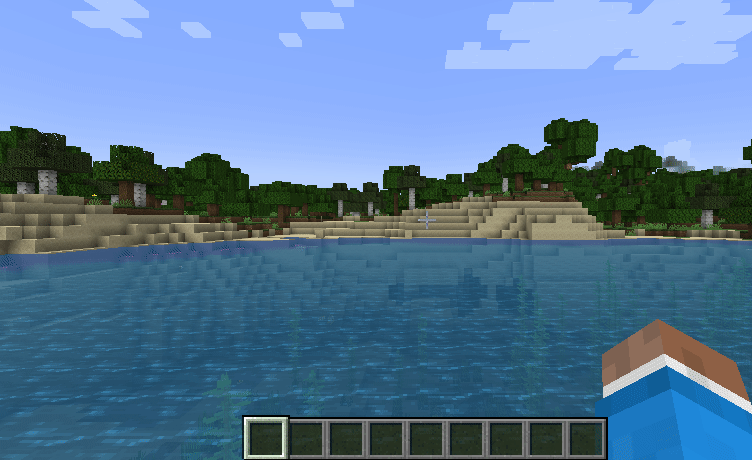
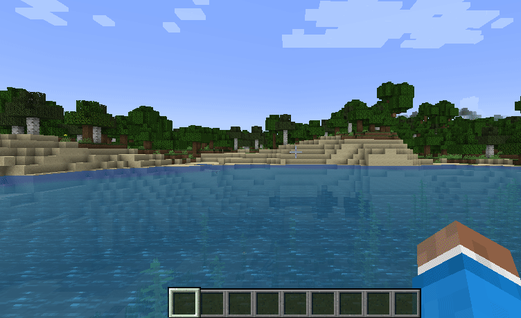

 

  

  <h3 align="center">Server plugin</h3>

  

    Quickly upload your current MOTD and server icon to <a href="https://motd.gg">motd.gg</a> to edit or share them.
     
    <a href="https://modrinth.com/plugin/motdgg"><strong>Download on modrinth »</strong></a>
     
     
    <a href="https://www.spigotmc.org/resources/motd-gg.106501">Spigot</a>
    ·
    <a href="https://www.curseforge.com/minecraft/bukkit-plugins/motd-gg">Curseforge</a>
  

## About motd.gg

<a href="https://motd.gg">motd.gg</a> allows you to quickly and intuitively create a MOTD for your Minecraft Java server. Features like our in-game preview allow you to see your newly created MOTD directly in your Minecraft server list, so you can always create the best MOTD for you and your players.
 
 

## Plugin features

 

### Edit your current motd via motd.gg
 

 
 

### Apply your new MOTD and server icon
 

 
 

### The motd changes instantly without a server restart
 
