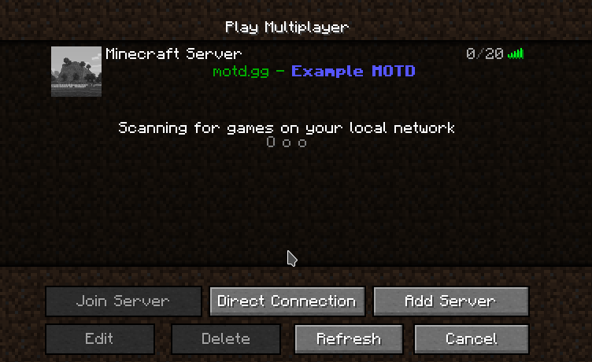

### motd.gg Bukkit Plugin
Quickly upload your current MOTD and server icon to [motd.gg](https://motd.gg) to edit or share them.

Apply your new MOTD and server icon with a single command.

The MOTD and server icon change instantly without a server restart.

### Downloads
- [GitHub Releases](https://github.com/aternosorg/motdgg-bukkit/releases)
- [Spigotmc](https://www.spigotmc.org/resources/motd-gg.47502/)
- [CurseForge/DevBukkit](https://www.curseforge.com/minecraft/bukkit-plugins/motd-gg)
- [Modrinth](https://modrinth.com/plugin/motdgg)
